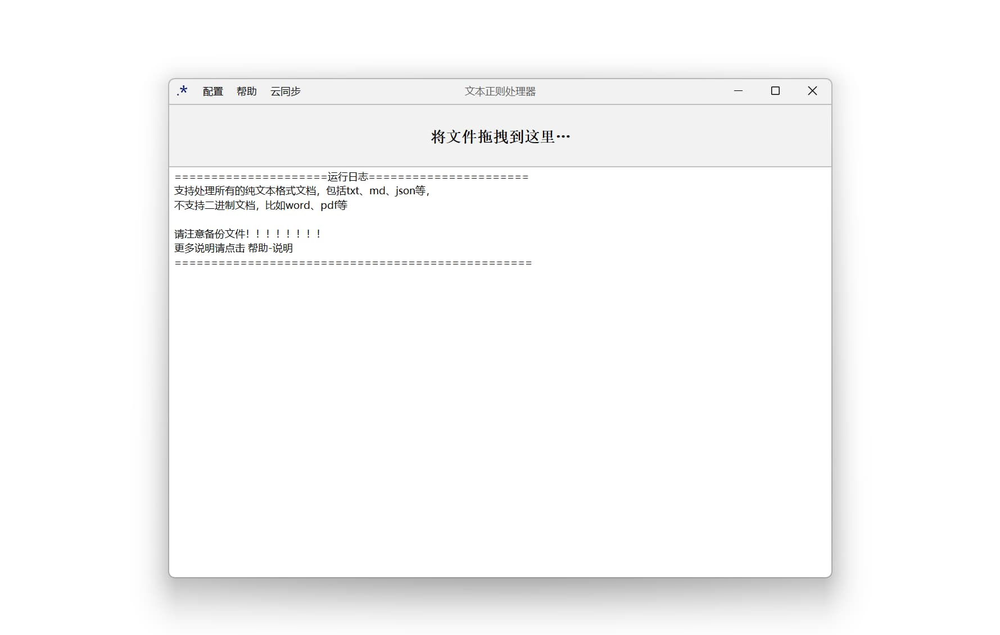
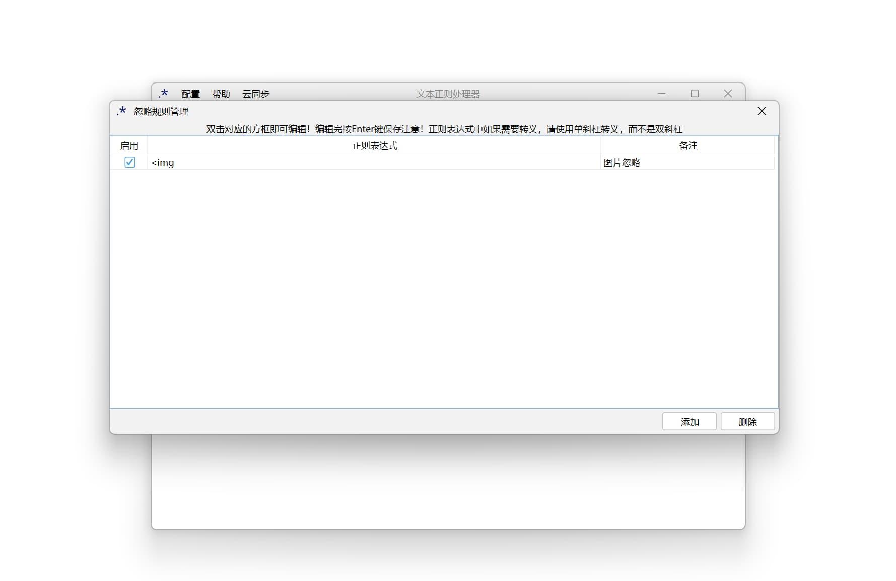
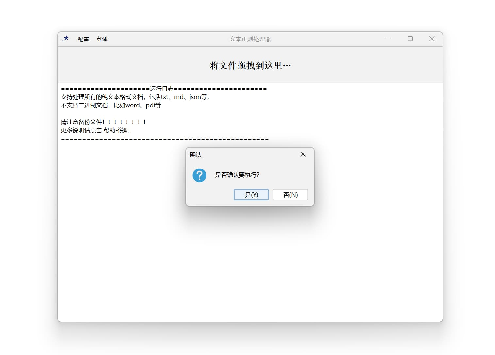

# Regex_TextProcessor

这是一个简单的文本文档正则表达式批处理工具

可以管理替换规则和忽略规则，使用Mysql数据库实现云同步（规则同步和账号功能）

Releases中有已经打包好的版本，连接了一个阿里云1核2G的Mysql数据库，仅供测试。

## 项目相关

依赖管理：Maven

JRE版本：17、构建最低版本要求：14

IDE：IDEA

数据库：Mysql

## 工作流程：

轮询 **替换规则管理页面** 中的规则：

程序会按照正则表达式对打开的文本自动 **逐行** 进行匹配替换，

替换前会首先检查该行是否符合 **忽略规则管理页面** 中的某一条规则

如果符合则跳过这一行不做任何处理

## 实现说明

正则表达式中的值会传递给replaceAll方法的第一个参数；

替换字符串中的值会传递给给replaceAll方法的第二个参数，

因此只需要符合Java中的正则语法即可，包括分组，前后断言等等。

**注意！正则表达式中如果需要转义，请使用单斜杠转义，而不是双斜杠**

关于云同步，并不是一直保持数据库连接，而是使用本地json来存放规则文件，

登入账号以及打开软件时会进行双向同步：

先将远程数据库的数据增量同步到本地的json文件，然后将本地的json文件解析并同步到数据库

此后只有当打开规则管理页面后才会再次连接数据库，

对于服务器同步到本地的规则，只要匹配表达式相同，则会被认为是同一条规则，且会用服务器的规则替换本地的规则

如果删除了规则管理界面的规则，则数据库中也会同步删除对应账号下的规则，添加同理。

切换账号会清除本地保存的所有记录。

## 运行截图

