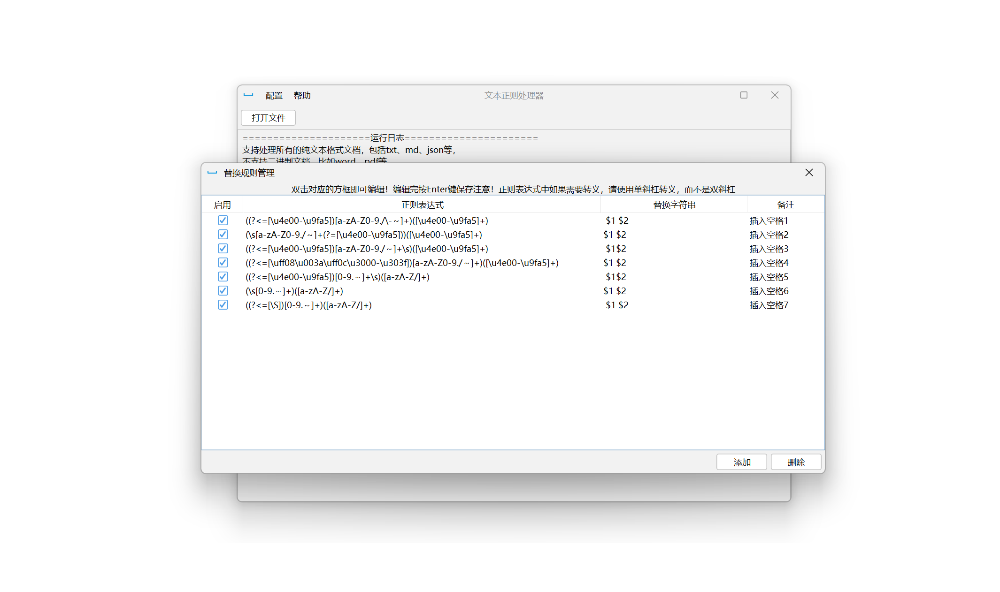
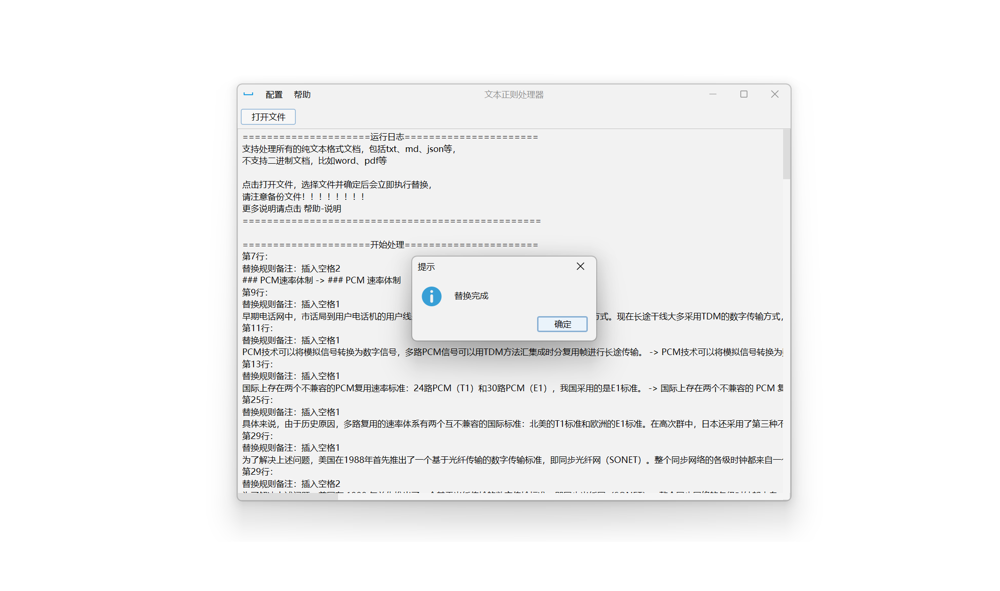

# Regex_TextProcessor

这是一个简单的文本文档正则表达式批处理工具（文本正则处理器）

特别之处在于其 **95%** 以上的代码由 AI 模型 **ChatGPT-3.5** 生成，

## 项目相关

依赖管理：Maven

JRE版本：18、最低版本要求：14

IDE：IDEA

## 工作流程：

轮询 **替换规则管理页面** 中的规则：

程序会按照正则表达式对打开的文本自动 **逐行** 进行匹配替换，

替换前会首先检查该行是否符合 **忽略规则管理页面** 中的某一条规则

如果符合则跳过这一行不做任何处理

## 实现说明

正则表达式中的值会传递给replaceAll方法的第一个参数；

替换字符串中的值会传递给给replaceAll方法的第二个参数，

因此只需要符合Java中的正则语法即可，包括分组，前后断言等等。

**注意！正则表达式中如果需要转义，请使用单斜杠转义，而不是双斜杠**

## 运行截图

